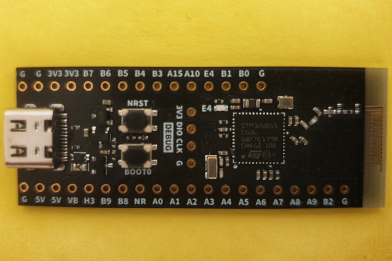

# micropython-board-STM32WB55CGU6


Micropython Board Definition for WeAct Studio Board with STM32WB55CGU6
[WeActStudio.STM32WB55CoreBoard](https://github.com/WeActStudio/WeActStudio.STM32WB55CoreBoard)


## Current status

The board definition has been tested with micropython v1.23.0 and 1.24.0-preview

Prerequisite for working BLE is STM Wireless Stack version v1.13.0. The board comes with protocol stack v1.19.0.2 which means you have to downgrade to version v1.13.0.  

## Downgrading Wireless stack

The link to the release notes and installation instructions is here:
[ReleaseNotes](https://github.com/STMicroelectronics/STM32CubeWB/blob/v1.13.0/Projects/STM32WB_Copro_Wireless_Binaries/STM32WB5x/Release_Notes.html)

Update via CLI is very flaky, STM32_Programmer_CLI crashes with segmentation fault on MacOS (Linux Windows might work better). STM32_Programmer_CLI is part of STMCubeProgrammer which can be downloaded from the STM site free of charge after registration. On MacOs the CLI can be found in the directory [install_dir]/STM32CubeProgrammer/STM32CubeProgrammer.app/Contents/MacOs/bin . The start address required to install the wireless stack depends on the firmare version and is listed in the release notes:

```
STM32_Programmer_CLI -c port=usb1 -fwupgrade v1.13.0/stm32wb5x_BLE_Stack_full_fw.bin 0x080C7000 firstinstall=0
```

crashes. Execute again until you see
```
FUS state is FUS_IDLE

FUS status is FUS_NO_ERROR

Old wireless stack delete ...

Deleting firmware ...
```

than try with firstinstall=1
```
STM32_Programmer_CLI -c port=usb1 -fwupgrade v1.13.0/stm32wb5x_BLE_Stack_full_fw.bin 0x080C7000 firstinstall=1
```

until you see:
```
USB speed   : Full Speed (12MBit/s)
Manuf. ID   : STMicroelectronics
Product ID  : DFU in FS Mode
SN          : 208A33933456
DFU protocol: 1.1
Board       : --
Device ID   : 0x0495
Device name : STM32WB5x/35xx
Flash size  : 1 MBytes
Device type : MCU
Revision ID : --  
Device CPU  : Cortex-M4
Download firmware image at address 0x80C7000 ...


Memory Programming ...
Opening and parsing file: stm32wb5x_BLE_Stack_full_fw.bin
  File          : stm32wb5x_BLE_Stack_full_fw.bin
  Size          : 179,23 KB 
  Address       : 0x080C7000 


Erasing memory corresponding to segment 0:
Erasing internal memory sectors [199 243]
erasing sector 0199 @: 0x080c7000 done
.....
erasing sector 0243 @: 0x080f3000 done
Download in Progress:
[==================================================] 100% 

File download complete
Time elapsed during download operation: 00:00:05.360

FUS state is FUS_IDLE

FUS status is FUS_NO_ERROR

Firmware Upgrade process started ...

Updating firmware ...
```

"Error: fwupgrade Command Failure" can be ignored


## Build
You need a working cross compile toolchain for the build, which you can get from the [xPack Project](https://xpack.github.io/dev-tools/arm-none-eabi-gcc/).
I highly recommend reading the official build instructions for [Micropython](https://docs.micropython.org/en/latest/develop/gettingstarted.html#compile-and-build-the-code) before you start.

Instructions to build micropython firmware with display driver in short.
```
git clone https://github.com/micropython/micropython.git
git clone https://github.com/jkorte-dev/micropython-board-STM32WB55CGU6
```
```
cd micropython
git submodule update --init
cd lib/micropython-lib/
cd ../../mpy-cross/
make
cd ../ports/stm32/
make submodules
ln -s ../../../../micropython-board-STM32H723VGT6/WEACT_WB55CG/ .
```
```
make BOARD=WEACT_WB55CG
```

dfu-util is required to install the firmware with DFU method, which is described here.

```
brew install dfu-util stlink # mac
sudo apt-get install dfu-util stlink# linux
```

Before you can flash the board you have to put the board into DFU mode:
Press the BOOT0 key and the reset key, then release the reset key, and release the BOOT0 key after 0.5 seconds.
Verify that the board is in DFU mode with:

```
dfu-util -l
```

To install to firmware execute
```
dfu-util -a 0  -D build-WEACT_WB55CG/firmware.dfu
```

or if you prefer st-link

```
st-info --probe
st-flash --format ihex write build-WEACT_WB55CG/firmware.hex
```

## Testing
Verify wireless stack version:

```
mpremote exec "import stm; print('rfcore_status =', stm.rfcore_status()); print('fw_version fus =' , stm.rfcore_fw_version(0)); print('fw_version ws =', stm.rfcore_fw_version(1))"
```

should report
```
fw_version ws = (1, 13, 0, 0, 5)
```


## Credits
credits to:
- The micropython team!
